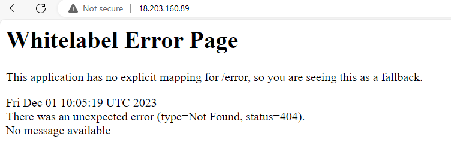
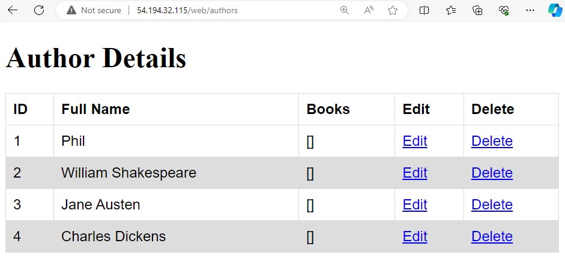
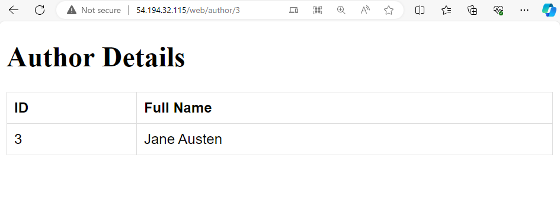
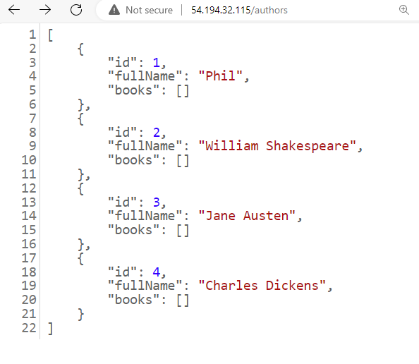
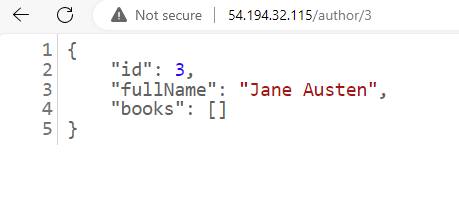

# LibraryProject2 Java-MySQL API/app

- [LibraryProject2 Java-MySQL API/app](#libraryproject2-java-mysql-apiapp)
  - [Overview](#overview)
  - [Requirements](#requirements)
      - [For app machine](#for-app-machine)
      - [For DB machine](#for-db-machine)
  - [Run the app](#run-the-app)
    - [Run in the foreground](#run-in-the-foreground)
      - [Stop the app (running in the foreground)](#stop-the-app-running-in-the-foreground)
    - [Run in the background](#run-in-the-background)
      - [Stop the app (running in the background)](#stop-the-app-running-in-the-background)
  - [Test the app](#test-the-app)
    - [Use the Web UI](#use-the-web-ui)
      - [View all authors](#view-all-authors)
      - [View specific author by id](#view-specific-author-by-id)
    - [Use the API](#use-the-api)
      - [View all authors](#view-all-authors-1)
      - [View specific author by id](#view-specific-author-by-id-1)

<br>

## Overview

"Library" Java-Springboot app
* Uses a MySQL database in the backend 
* Includes a...
  * GUI and
  * API

<br>

## Requirements

#### For app machine

* Hardware
  * Min 2 GB memory e.g. AWS `t3.small` or Azure `B1ms`
* Software
  * Ubuntu 22.04 LTS (Can run on Windows 10/11 also)
  * Maven
  * Java 17
  * `ProjectLibrary2` folder is the "app" folder
  * App uses the following environment variables to connect to the database:
    * Variable name: `DB_HOST`
      * Description: Acts like a connection string
      * Value: `jdbc:mysql://$DATABASE_IP:3306/library`
    * Variable name: `DB_USER`
      * Description: The username setup in your MySQL database
      * Value: Can be whatever what you want to setup
    * Variable name: `DB_PASS` 
      * Description: The password setup in your MySQL database
      * Value: Can be whatever what you want to setup

<br>

#### For DB machine

* Hardware
  * Min 1 GB memory e.g. AWS `t3a.micro` or `t3.micro` or Azure `B1s`
* Software
  * Ubuntu 22.04 LTS (Can run on Windows 10/11 also)
  * MySQL database
  * Database must be seeded via an SQL script [library.sql](library.sql)

<br>

## Run the app

### Run in the foreground

1. Go into the folder `ProjectLibrary2` (this is the "app" folder)
2. Run `mvn spring-boot:run`
   1. You will see a lot of text outputted to the screen
   2. At the bottom of the screen output, it should look similar to this:

     ```
     2023-11-10T11:40:35.999Z  INFO 40420 --- [  restartedMain] o.s.b.w.embedded.tomcat.TomcatWebServer  : Tomcat started on port(s): 5000 (http) with context path ''
     2023-11-10T11:40:36.008Z  INFO 40420 --- [  restartedMain] c.s.j.springapi.SpringapiApplication     : Started SpringapiApplication in 3.234 seconds (process running for 3.602)
     2023-11-10T11:41:24.224Z  INFO 40420 --- [nio-5000-exec-1] o.a.c.c.C.[Tomcat].[localhost].[/]       : Initializing Spring DispatcherServlet 'dispatcherServlet'
     2023-11-10T11:41:24.225Z  INFO 40420 --- [nio-5000-exec-1] o.s.web.servlet.DispatcherServlet        : Initializing Servlet 'dispatcherServlet'
     2023-11-10T11:41:24.226Z  INFO 40420 --- [nio-5000-exec-1] o.s.web.servlet.DispatcherServlet        : Completed initialization in 1 ms
     ```

<br>

#### Stop the app (running in the foreground)

Stop the app and get back control of the terminal:

1. Use CTRL+C
2. Then ENTER

<br>

### Run in the background

☝️ This is an alternative way to run the app to avoid engaging the terminal.

Run the `mvn spring-boot:start` command.

<br>

#### Stop the app (running in the background)

Run `mvn spring-boot:stop` command.

<br>

## Test the app

ℹ️ If you have a reverse proxy working, you won't need to include the port number in the address. For example: `http://34.245.124.148:5000/authors` would become `http://34.245.124.148/authors`

Otherwise, go to `<ip-address>:5000`

There is no explicit mapping for the base URL (base path), so you should get an error like this:


<br>

### Use the Web UI

#### View all authors

1. Go to `<public-ip-of-app>:5000/web/authors` e.g. `http://34.245.124.148:5000/web/authors`
2. You should see 4 authors listed:

   

3. *Edit* link for each author works, however, *Delete* function does not.

<br>

#### View specific author by id

1. Go to `<public-ip-of-app>:5000/web/author/<id-of-author>` e.g. `http://34.245.124.148:5000/web/author/3`
2. You should see just the author with id = 3:

   

<br>

### Use the API

#### View all authors

1. Go to `<public-ip-of-app>:5000/authors` e.g. `http://34.245.124.148:5000/authors`
2. You should see 4 authors listed:

   

<br>

#### View specific author by id

1. Go to `<public-ip-of-app>:5000/author/<id-of-author>` e.g. `http://34.245.124.148:5000/author/3`
2. You should see just the author with id = 3:

   

<br>